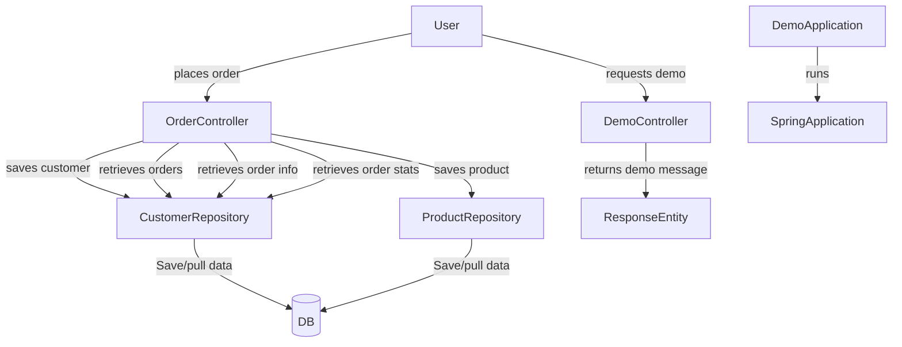
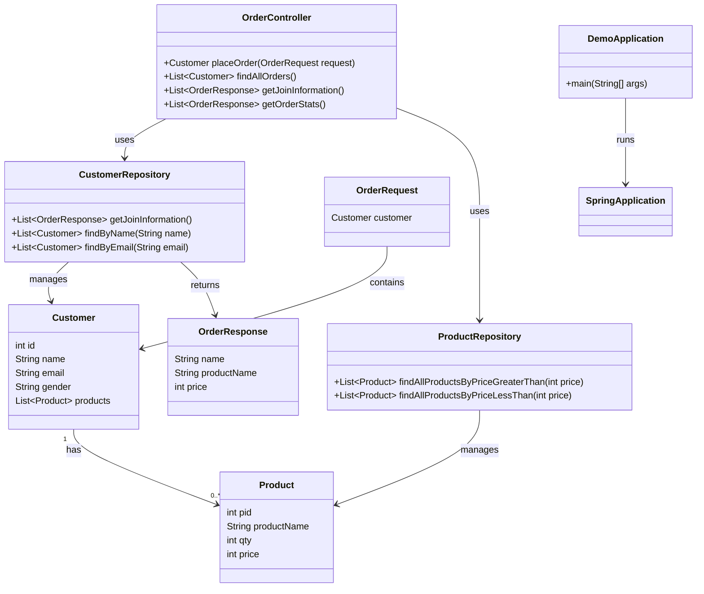
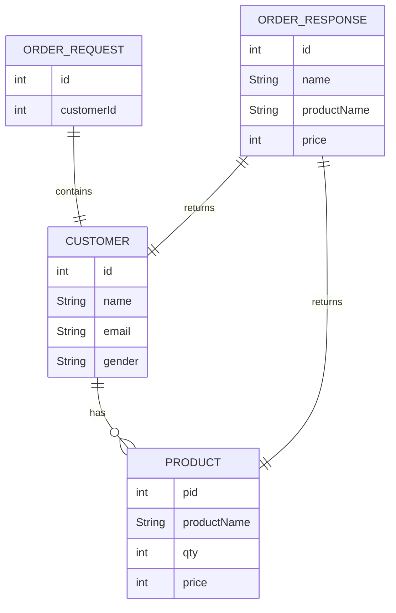
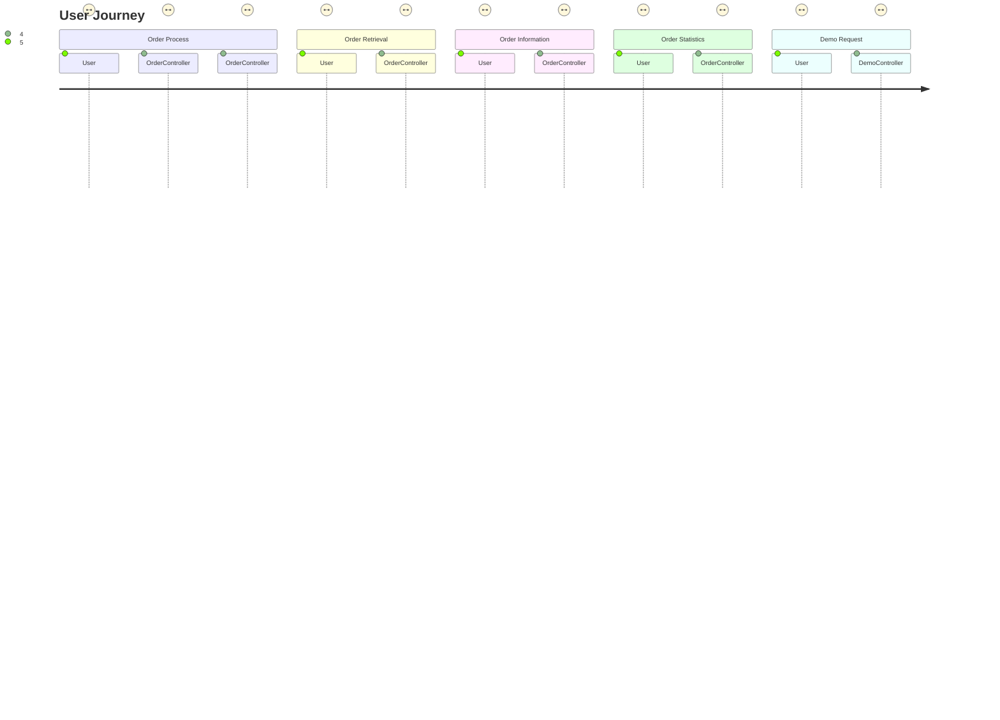

## Below are the architecture diagrams of the project:

### Flow Diagram

```mermaid
flowchart TD
    A[User] -->|places order| B[OrderController]
    B -->|saves customer| C[CustomerRepository]
    C[CustomerRepository] -->|Save/pull data| DB[(DB)]
    B -->|saves product| D[ProductRepository]
    D[ProductRepository] -->|Save/pull data| DB[(DB)]
    B -->|retrieves orders| C
    B -->|retrieves order info| C
    B -->|retrieves order stats| C
    A -->|requests demo| E[DemoController]
    E -->|returns demo message| F[ResponseEntity]
    G[DemoApplication] -->|runs| H[SpringApplication]
```
### Class Diagram

```mermaid
classDiagram
    direction TB

    class Product {
        int pid
        String productName
        int qty
        int price
    }

    class Customer {
        int id
        String name
        String email
        String gender
        List~Product~ products
    }

    class ProductRepository {
        +List~Product~ findAllProductsByPriceGreaterThan(int price)
        +List~Product~ findAllProductsByPriceLessThan(int price)
    }

    class CustomerRepository {
        +List~OrderResponse~ getJoinInformation()
        +List~Customer~ findByName(String name)
        +List~Customer~ findByEmail(String email)
    }

    class OrderRequest {
        Customer customer
    }

    class OrderResponse {
        String name
        String productName
        int price
    }

    class OrderController {
        +Customer placeOrder(OrderRequest request)
        +List~Customer~ findAllOrders()
        +List~OrderResponse~ getJoinInformation()
        +List~OrderResponse~ getOrderStats()
    }

    class DemoApplication {
        +main(String[] args)
    }

    Customer "1" --> "0..*" Product : has
    ProductRepository --> Product : manages
    CustomerRepository --> Customer : manages
    CustomerRepository --> OrderResponse : returns
    OrderRequest --> Customer : contains
    OrderController --> CustomerRepository : uses
    OrderController --> ProductRepository : uses
    DemoApplication --> SpringApplication : runs
```

### Entity Relationship Diagram

```mermaid
erDiagram
    CUSTOMER {
        int id
        String name
        String email
        String gender
    }
    PRODUCT {
        int pid
        String productName
        int qty
        int price
    }
    ORDER_REQUEST {
        int id
        int customerId
    }
    ORDER_RESPONSE {
        int id
        String name
        String productName
        int price
    }

    CUSTOMER ||--o{ PRODUCT : "has"
    ORDER_REQUEST ||--|| CUSTOMER : "contains"
    ORDER_RESPONSE ||--|| CUSTOMER : "returns"
    ORDER_RESPONSE ||--|| PRODUCT : "returns"
```

### User Journey Diagram

```mermaid
journey
    title User Journey
    section Order Process
      User: Places Order: 5: OrderController
      OrderController: Saves Customer: 4: CustomerRepository
      OrderController: Saves Product: 4: ProductRepository
    section Order Retrieval
      User: Requests All Orders: 5: OrderController
      OrderController: Retrieves Orders: 4: CustomerRepository
    section Order Information
      User: Requests Order Info: 5: OrderController
      OrderController: Retrieves Order Info: 4: CustomerRepository
    section Order Statistics
      User: Requests Order Stats: 5: OrderController
      OrderController: Retrieves Order Stats: 4: CustomerRepository
    section Demo Request
      User: Requests Demo: 5: DemoController
      DemoController: Returns Demo Message: 4: ResponseEntity
```

